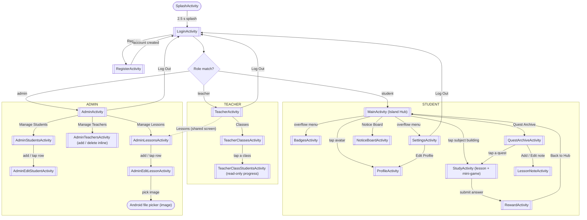
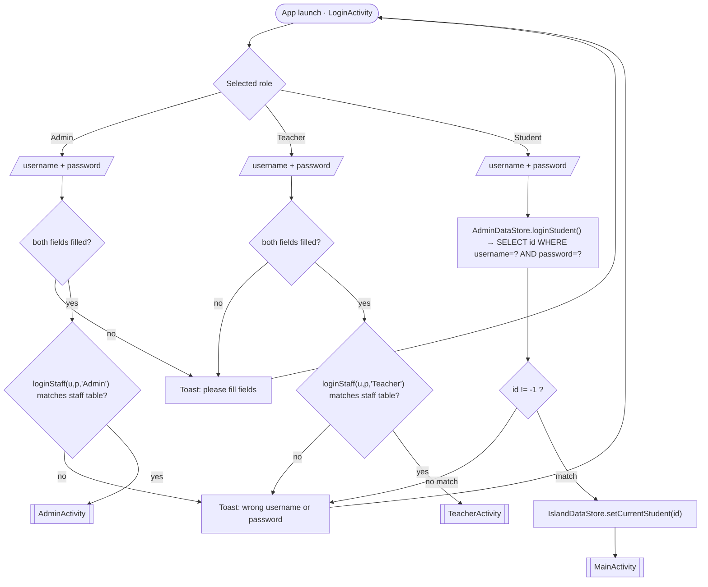
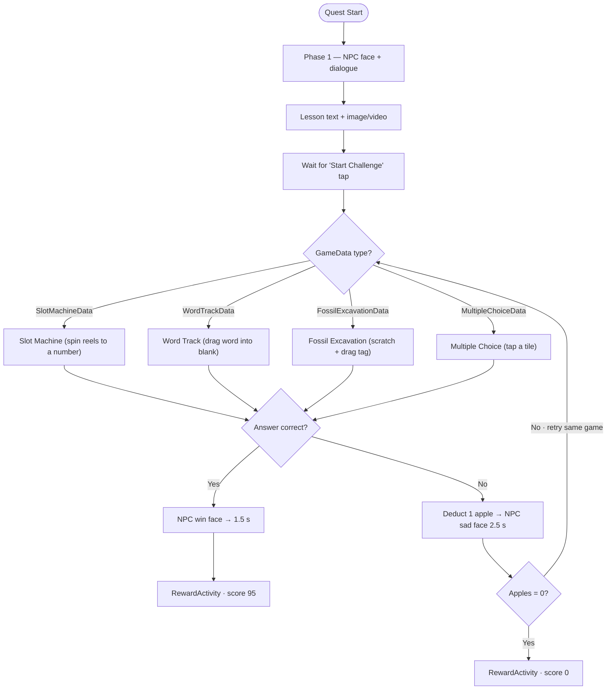
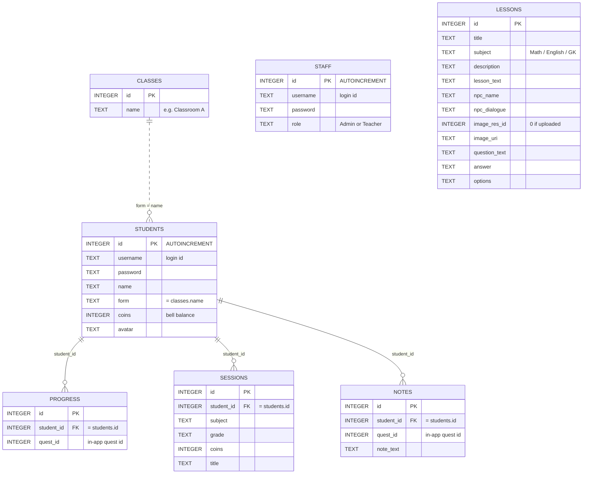

# Study Crossing — System Report

> Game-based e-learning Android app (Kotlin + XML, raw SQLite via `SQLiteOpenHelper`).
> This report documents the **navigation flowcharts**, the **Entity Relationship Diagram (ERD)**,
> and **every interface (screen)** in the app.
>
> _Companion document:_ `docs/data-model-and-flow.html` holds the deeper data-layer write-up
> (layered architecture, UML sequence diagrams, SQLite connection deep-dive, full CRUD map).
> This report is the screen-and-flow level view.
>
> **TODO for you:** drop a screenshot under each interface where it says _“📸 Screenshot:”_,
> and expand any section with your own commentary as the assignment requires.

---

## 1. Overview

**Study Crossing (学霸森友会)** is a cozy, Animal-Crossing-themed revision app for high-school
students. Learning is delivered as **quests**: the student reads a short lesson narrated by an NPC,
then plays a themed **mini-game** to answer the question. Correct answers earn an in-game currency
(**Coins / bells**) and a letter **grade (S / A / B / C)**.

| Item | Value |
|---|---|
| Platform | Android (min/target per `build.gradle.kts`) |
| Language / UI | Kotlin + XML layouts |
| Persistence | Raw SQLite — `StudyCrossing.db` (v2, **7 tables**), no Room/ORM |
| Roles | **Student**, **Teacher**, **Admin** |
| Screens (Activities) | **21** |
| In-app quests | **14** (in-memory pool in `IslandDataStore.buildQuestPool()`) |
| Mini-game types | **4** — Slot Machine, Word Track, Fossil Excavation, Multiple Choice |

### Demo accounts (seeded on first launch)

| Role | Username | Password | Notes |
|---|---|---|---|
| Admin | `admin` | `1234` | Single seeded admin; cannot self-register |
| Teacher | `teacher` | `1234` | Teachers are created by the admin |
| Student | (7 seeded students) | `1234` | New students may self-register |

---

## 2. Flowcharts

> Diagrams use Mermaid (GitHub renders these automatically).
> **Double-bar `[[ ]]`** = screen · **oval `([ ])`** = start/terminator/external · **diamond `{ }`** = decision.

### 2.1 Complete App Navigation (all roles)

Every screen and every forward navigation across the three roles. `Log Out` is the only path that
crosses back between zones; it always returns to `LoginActivity`.

**Notes**
- `SplashActivity` auto-opens `LoginActivity` (the only `LAUNCHER`).
- The role check in `LoginActivity` splits the app into three independent zones.
- The **dashed** arrow marks the one reused screen: a teacher's *Lessons* opens the same
  `AdminLessonsActivity` the admin uses.
- Leaf screens (`Badges`, `LessonNote`, `AdminEditStudent`, `AdminEditLesson`,
  `TeacherClassStudents`, `Profile`, `NoticeBoard`) return via the system **Back** button.

### 2.2 Authentication & Role Routing

All three roles are validated against SQLite. The student `id` returned at login becomes
`currentStudentId`, which scopes every later progress / session / note query.

### 2.3 Quest Gameplay Loop (inside `StudyActivity`)

- **Phase 1** is the lesson (NPC + field-guide panel); **Phase 2** is the mini-game loaded when the
  player taps *Start Challenge*.
- The mini-game type is chosen by the quest's `GameData` subclass, **not** fixed per subject.
- A wrong answer costs one of three apples; losing all three ends the quest at **score 0**, while a
  correct answer scores **95**. `RewardActivity` turns the score into a grade + bells
  (`coins = score × 10`).

---

## 3. Entity Relationship Diagram (ERD)

Physical schema of `StudyCrossing.db` — the **7 real SQLite tables**. Solid line = real per-row
reference (child stores the parent's `id`); dashed line = soft / non-enforced reference (matched by
text value, no SQL foreign key). The label is the linking column.

### Relationships

- **STUDENTS is the hub:** one student owns many `PROGRESS`, `SESSIONS` and `NOTES` rows, each
  linked by the real `student_id` value (solid lines).
- **CLASSES → STUDENTS is soft (dashed):** a student's class is stored as the text `form` column and
  matched to `classes.name` by value — there is **no** enforced foreign key.
- **STAFF** and **LESSONS** are standalone. STAFF holds the Admin/Teacher login accounts; LESSONS is
  the admin/teacher upload table.
- **`quest_id`** in PROGRESS and NOTES references an **in-memory** quest id (from
  `IslandDataStore.buildQuestPool()`), not another table — so it is not drawn as a relationship.

### Data Dictionary

| Table | Columns | Purpose |
|---|---|---|
| **students** | id PK · username · password · name · form · coins · avatar | Student accounts (student login authenticates here) |
| **staff** | id PK · username · password · role | Admin & Teacher login accounts (role = Admin / Teacher) |
| **classes** | id PK · name | Class names (e.g. Classroom A / B) |
| **lessons** | id PK · title · subject · description · lesson_text · npc_name · npc_dialogue · image_res_id · image_uri · question_text · answer · options | Admin/teacher uploaded learning materials |
| **progress** | id PK · student_id FK · quest_id | Which student finished which quest |
| **sessions** | id PK · student_id FK · subject · grade · coins · title | Per-student play history |
| **notes** | id PK · student_id FK · quest_id · note_text | Per-student lesson notes |

> Full CRUD map, seed data, and the SQLite connection chain are documented in
> `docs/data-model-and-flow.html`.

---

## 4. Interface Documentation

The app has **21 Activities**. The two in-game panels (`TopFragment`, `BottomFragment`) are
Fragments hosted inside `StudyActivity` and are described under §4.8.

### 4.0 Screen Inventory

| # | Screen (Activity) | Layout | Zone |
|---|---|---|---|
| 1 | SplashActivity | `activity_splash` | Entry |
| 2 | LoginActivity | `activity_login` | Auth |
| 3 | RegisterActivity | `activity_register` | Auth |
| 4 | MainActivity | `activity_main` | Student |
| 5 | ProfileActivity | `activity_profile` | Student |
| 6 | NoticeBoardActivity | `activity_notice_board` | Student |
| 7 | QuestArchiveActivity | `activity_quest_archive` | Student |
| 8 | StudyActivity | `activity_study` | Student |
| 9 | LessonNoteActivity | `activity_lesson_note` | Student |
| 10 | RewardActivity | `activity_reward` | Student |
| 11 | BadgesActivity | `activity_badges` | Student |
| 12 | SettingsActivity | `activity_settings` | Student |
| 13 | TeacherActivity | `activity_teacher` | Teacher |
| 14 | TeacherClassesActivity | `activity_teacher_classes` | Teacher |
| 15 | TeacherClassStudentsActivity | `activity_teacher_class_students` | Teacher |
| 16 | AdminActivity | `activity_admin` | Admin |
| 17 | AdminStudentsActivity | `activity_admin_students` | Admin |
| 18 | AdminTeachersActivity | `activity_admin_teachers` | Admin |
| 19 | AdminEditStudentActivity | `activity_admin_edit_student` | Admin |
| 20 | AdminLessonsActivity | `activity_admin_lessons` | Admin/Teacher |
| 21 | AdminEditLessonActivity | `activity_admin_edit_lesson` | Admin/Teacher |

---

### 4.1 Entry & Authentication

#### 1 · SplashActivity
- **Purpose:** branding splash shown on launch.
- **Key UI:** full-screen logo / title artwork.
- **Behaviour:** waits **2.5 s**, then auto-navigates to `LoginActivity` and `finish()`es itself.
  No user interaction.
- **Data:** none.
- 📸 Screenshot:

#### 2 · LoginActivity  *(LAUNCHER)*
- **Purpose:** sign in and route the user to the correct home screen by role.
- **Key UI:** three selectable **role cards** (Student / Teacher / Admin, highlight on tap),
  username + password `EditText`s, **Log In** button, **“New here? Register”** link.
- **Actions / Navigation:**
  - Validates both fields are non-empty (else Toast).
  - **Admin / Teacher** → `AdminDataStore.loginStaff(u, p, role)` against the `staff` table → on
    success opens `AdminActivity` / `TeacherActivity`.
  - **Student** → `AdminDataStore.loginStudent(u, p)`; if the returned id ≠ −1, calls
    `IslandDataStore.setCurrentStudent(id)` and opens `MainActivity`.
  - **Register** link → `RegisterActivity`.
- **Data:** `students`, `staff` tables (via `AdminDataStore`).
- 📸 Screenshot:

#### 3 · RegisterActivity
- **Purpose:** create a new account.
- **Key UI:** role cards, username / password / confirm-password fields, **Register** button,
  **“Already have an account? Log in”** link.
- **Actions / Navigation:**
  - Checks non-empty fields and matching passwords.
  - **Student** → `AdminDataStore.registerStudent()` (inserts a real `students` row; rejects a taken
    username) → back to `LoginActivity`.
  - **Teacher / Admin** → no self-registration; shows a Toast and returns to `LoginActivity`.
- **Data:** `students` table.
- 📸 Screenshot:

---

### 4.2 Student — Hub & Profile

#### 4 · MainActivity  *(Island Hub)*
- **Purpose:** the student's home / spoke centre.
- **Key UI:** welcome card (avatar + “Hi {name}!”), **Coin** balance, three **subject buildings**
  (Math / English / GK), **Notice Board** and **Quest Archive** shortcut tiles, toolbar overflow
  menu (**Badges**, **Settings**).
- **Actions / Navigation:**
  - Welcome card → `ProfileActivity` (`editMode = true`).
  - Subject building → `openStudy(subject)` opens the first quest of that subject in `StudyActivity`.
  - Notice Board / Quest Archive tiles → respective activities.
  - Overflow → `BadgesActivity` / `SettingsActivity`.
  - `onResume()` refreshes name, avatar and coin balance.
- **Data:** `IslandDataStore` (player name/avatar, coins, quests).
- 📸 Screenshot:

#### 5 · ProfileActivity  *(Passport)*
- **Purpose:** set nickname and choose an avatar (villager).
- **Key UI:** nickname `EditText`, five avatar cards (Cat / Dog / Bear / Squirrel / Frog),
  submit button.
- **Actions / Navigation:**
  - **First-time** (no `editMode`): button reads “Stamp My Passport!”, saves via
    `IslandDataStore.setPlayer()` and opens `MainActivity`.
  - **Edit mode** (from hub/settings): fields are prefilled, button reads “Save Changes”, saves and
    `finish()`es back.
  - Rejects an empty nickname.
- **Data:** `IslandDataStore.setPlayer()` (→ `students` profile).
- 📸 Screenshot:

---

### 4.3 Student — Progress Screens

#### 6 · NoticeBoardActivity  *(Bulletin Board)*
- **Purpose:** show the student's **completed quest history** as cards pinned to a cork board.
- **Key UI:** NPC speech bubble with totals (quests finished + coins earned, with singular/plural
  handling), `RecyclerView` of session cards (`SessionAdapter`), empty-state hint, auto-shrinking
  cork board.
- **Actions / Navigation:** read-only list; back via toolbar chevron. No forward navigation.
- **Data:** `IslandDataStore.getSessionHistory()` (→ `sessions` table).
- 📸 Screenshot:

#### 7 · QuestArchiveActivity
- **Purpose:** show **all quests** (done or not) so the student can replay any of them. Differs from
  Notice Board, which shows only completed ones.
- **Key UI:** NPC bubble (count of replayable quests), `RecyclerView` of quest rows (`TaskAdapter`)
  with a **DONE** stamp on completed quests and an **Add / Edit Note** button.
- **Actions / Navigation:**
  - Row tap → `StudyActivity` (replay that quest).
  - Note button → `LessonNoteActivity`.
  - `onResume()` reloads so note buttons update after returning.
- **Data:** `IslandDataStore.buildTaskList()` (quest pool + `progress`/`notes`).
- 📸 Screenshot:

#### 9 · LessonNoteActivity
- **Purpose:** let the student write a **personal note** for a lesson (separate from admin lesson
  content).
- **Key UI:** lesson title, multi-line note `EditText`, **Save** button, **Delete** button (shown
  only when a note already exists), back arrow.
- **Actions / Navigation:**
  - Loads existing note via `getNote(questId)`; saving an empty note deletes it.
  - Delete shows a confirm dialog. Both Save and Delete `finish()` back to Quest Archive.
- **Data:** `IslandDataStore.getNote / setNote / deleteNote / hasNote` (→ `notes` table).
- 📸 Screenshot:

---

### 4.4 Student — Quest & Reward

#### 8 · StudyActivity  *(Quest host)*
- **Purpose:** run a single quest as two stacked phases.
- **Key UI:** subject-tinted toolbar (icon + subject label + challenge title), **three apple** life
  icons, top container (`TopFragment`), **Start Challenge** button, bottom container
  (`BottomFragment`, shown in Phase 2).
- **Behaviour:**
  - **Phase 1:** `TopFragment` shows the NPC, dialogue and the subject lesson panel.
  - Tapping **Start Challenge** hides the lesson panel, reveals the divider + bottom container, and
    loads `BottomFragment` (the mini-game).
  - `deductApple()` hides one apple and shows the NPC's worried face for 2.5 s on a wrong answer;
    losing all three apples opens `RewardActivity` with **score 0**.
- **Inputs:** `questionId`, `subject` (Intent extras). **Output:** → `RewardActivity`.
- **Data:** `IslandDataStore.getQuestion()` (quest pool).
- 📸 Screenshot (Phase 1) / (Phase 2):

#### 10 · RewardActivity
- **Purpose:** quest result / payout screen.
- **Logic:** grade from score — `≥90 → S`, `≥75 → A`, `≥60 → B`, else `C`; `coins = score × 10`.
  Always calls `recordSession(subject, grade, coins)`; if score ≥ 90 also calls
  `markDone(questId)`.
- **Key UI:** grade halo + badge/letter, themed subtitle, NPC face and dialogue (per grade),
  coins-earned label, **Mail to a Friend** (share) button, **Back to Hub** button.
- **Actions / Navigation:** Share → system share sheet; Back to Hub → `MainActivity`
  (`FLAG_ACTIVITY_CLEAR_TOP`).
- **Data:** `IslandDataStore.recordSession / markDone` (→ `sessions`, `progress`, student `coins`).
- 📸 Screenshot:

---

### 4.5 Student — Rewards & Settings

#### 11 · BadgesActivity  *(Trophy Case)*
- **Purpose:** show achievement badges and overall progress.
- **Key UI:** progress label `earned / 5` + green progress bar, **5 badge cards** built
  programmatically (icon halo, name, requirement, rarity chip, Earned/Locked pill).
- **Badge rules:** S-Rank Explorer (any S), Triple Scholar (≥3 quests), Coin Collector (≥500 coins),
  Completionist (all quests done), S-Tier Master (≥3 S grades) — all derived from session history.
- **Navigation:** back arrow only.
- **Data:** `IslandDataStore.getSessionHistory()`, `getAllQuests()`.
- 📸 Screenshot:

#### 12 · SettingsActivity
- **Purpose:** account / app settings.
- **Key UI rows:** **Edit Profile** → `ProfileActivity`; **Background Music** (coming-soon Toast);
  **Reset Progress** (confirm dialog → `IslandDataStore.resetAll()`); **Log Out** (confirm →
  `setCurrentStudent(-1)` → `LoginActivity` with cleared task stack); **Credits** dialog;
  **App Version** (display only). Back arrow.
- **Data:** `IslandDataStore` (reset / session).
- 📸 Screenshot:

---

### 4.6 Teacher Zone

#### 13 · TeacherActivity  *(Teacher Home)*
- **Purpose:** teacher dashboard. Teachers manage learning materials and view class progress, but
  **cannot** edit student accounts.
- **Key UI:** “Hi {name}!”, two cards — **Lessons** (with count) and **Classes** (with count) —
  **Log Out** button, back arrow.
- **Actions / Navigation:** Lessons → `AdminLessonsActivity` (shared screen); Classes →
  `TeacherClassesActivity`; Log Out / back → `LoginActivity` (confirm dialog). `onResume()` refreshes
  lesson and class counts.
- **Data:** `AdminDataStore.getAllLessons / getAllClasses`.
- 📸 Screenshot:

#### 14 · TeacherClassesActivity
- **Purpose:** list all classes and create new ones.
- **Key UI:** `RecyclerView` of classes (`ClassAdapter`), **+ New Class** button (dialog with a name
  field), empty-state hint.
- **Actions / Navigation:** New Class → `AdminDataStore.addClass()`; row tap →
  `TeacherClassStudentsActivity` (passes `className`). `onResume()` reloads.
- **Data:** `classes` table.
- 📸 Screenshot:

#### 15 · TeacherClassStudentsActivity
- **Purpose:** view the students in one class with their progress, and assign students into it.
- **Key UI:** class title, `RecyclerView` of students with progress bars
  (`StudentProgressAdapter`), **+ Add Student** button (dialog listing students from other classes),
  per-row **Move** action, empty-state hint.
- **Actions / Navigation:** Add/Move → `AdminDataStore.assignStudentToClass()`; back via toolbar.
  Read-only with respect to grades.
- **Data:** `AdminDataStore.getStudentsByClass()`, `IslandDataStore` progress.
- 📸 Screenshot:

---

### 4.7 Admin Zone

#### 16 · AdminActivity  *(Admin Dashboard)*
- **Purpose:** admin home; entry to all management screens.
- **Key UI:** “Hi {name}!”, three cards — **Manage Students**, **Manage Teachers**,
  **Manage Lessons** — each showing a live count; **Log Out** button; back arrow.
- **Actions / Navigation:** cards open the three management lists; Log Out / back / system-back all
  return to `LoginActivity` (confirm dialog). `onResume()` refreshes the three counts.
- **Data:** `AdminDataStore.getAllStudents / getAllTeachers / getAllLessons`.
- 📸 Screenshot:

#### 17 · AdminStudentsActivity
- **Purpose:** list all student accounts.
- **Key UI:** `RecyclerView` (`StudentAdapter`), **+ Add** button, empty-state hint.
- **Actions / Navigation:** **+ Add** → `AdminEditStudentActivity` (new); row tap → edit that
  student. `onResume()` reloads after add/edit/delete.
- **Data:** `students` table.
- 📸 Screenshot:

#### 18 · AdminTeachersActivity
- **Purpose:** manage teacher accounts (the admin is the only one who can create them).
- **Key UI:** `RecyclerView` (`TeacherAdapter`), **+ Add** button (dialog: username + password),
  per-row **Remove** action, empty-state hint.
- **Actions / Navigation:** Add → `addTeacher()` (rejects duplicate username); Remove → confirm →
  `deleteTeacher()`. CRUD is **inline** (no separate editor screen).
- **Data:** `staff` table (role = Teacher).
- 📸 Screenshot:

#### 19 · AdminEditStudentActivity
- **Purpose:** add or edit a single student.
- **Key UI:** fields for **name**, **form/class**, **coins**; **Save** button; **Delete** button
  (edit mode only); dynamic title (“Add Student” / “Edit Student”); back arrow.
- **Actions / Navigation:** Save → `addStudent()` / `updateStudent()` (coins default to 0 if blank);
  Delete → confirm → `deleteStudent()`. All paths `finish()` back to the list.
- **Data:** `students` table.
- 📸 Screenshot:

---

### 4.8 Lessons (shared by Admin & Teacher)

#### 20 · AdminLessonsActivity
- **Purpose:** list all learning materials. Opened by both admin and teacher.
- **Key UI:** `RecyclerView` (`LessonAdapter`), **+ Add** button, empty-state hint.
- **Actions / Navigation:** **+ Add** → `AdminEditLessonActivity` (new); row tap → edit.
  `onResume()` reloads.
- **Data:** `lessons` table.
- 📸 Screenshot:

#### 21 · AdminEditLessonActivity
- **Purpose:** add or edit a learning material; fields adapt to the chosen subject.
- **Key UI:** subject **chips** (Math / English / GK) that re-label the question/answer fields,
  fields for **title, lesson text, description, NPC name, NPC dialogue, question, answer, options**,
  an **image preview** + **Pick Image** button, **Save** and **Delete** (edit mode) buttons.
  - *Math* hides the options field (slot-machine numeric answer); *English / GK* show comma-separated
    options.
- **Actions / Navigation:** Pick Image → system document picker (`ACTION_OPEN_DOCUMENT`, takes a
  persistable URI); Save → `addLesson()` / `updateLesson()`; Delete → confirm → `deleteLesson()`.
- **Data:** `lessons` table.
- 📸 Screenshot:

#### In-game Fragments (hosted by `StudyActivity`)
- **TopFragment** — Phase-1 lesson panel: NPC full-body image, name and dialogue bubble, and a
  subject-specific lesson panel (Math blueprint / English handbook / GK field notes) that can show an
  image **or** a looping muted video. Exposes `showWrongFace()` / `showNormalFace()` / `showWinFace()`
  / `hideLessonPanel()` for `StudyActivity` to drive.
- **BottomFragment** — Phase-2 mini-game host. Dispatches on the quest's `GameData` subclass to one
  of four games — **Slot Machine** (`setupSlotMachine`), **Word Track** (`setupWordTrack`),
  **Multiple Choice** (`setupMultipleChoice`), **Fossil Excavation** (`setupFossilExcavation`) — and
  on submit computes the score and opens `RewardActivity`.
- 📸 Screenshot (each mini-game):

---

## 5. Appendix — Adapters & Helpers (supporting classes)

| Class | Used by | Role |
|---|---|---|
| `SessionAdapter` | NoticeBoardActivity | Renders completed-session cards |
| `TaskAdapter` | QuestArchiveActivity | Renders quest rows → Study / LessonNote |
| `StudentAdapter` | AdminStudentsActivity | Student list rows → edit |
| `TeacherAdapter` | AdminTeachersActivity | Teacher list rows + Remove |
| `LessonAdapter` | AdminLessonsActivity | Lesson list rows → edit |
| `ClassAdapter` | TeacherClassesActivity | Class list rows → class students |
| `StudentProgressAdapter` | TeacherClassStudentsActivity | Student rows with progress bars + Move |
| `Utils` | all activities | Edge insets, toolbar setup, dp/px, NPC art helpers |
| `AdminDataStore` / `IslandDataStore` | all activities | Facades over `DatabaseHelper` (SQLite) |
| `MyApp` | — | `Application` that initialises both data stores on startup |

---

_End of report. Add screenshots and expand commentary as needed for submission._
